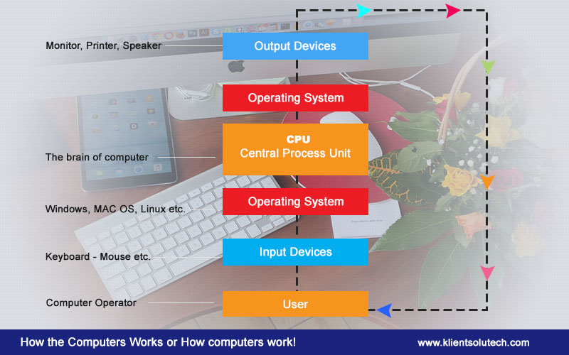
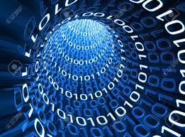

# Read: 04b - Computer Architecture and Logic

## - HOW  COMPUTERS WORK ? WHAT MAKES A COMPUER, A COMPUTER ?

*It's a thinking machine, takes input store information, process it and then output the results. *
## So the four thing common to all computers :
- Input.
- Storage.
- Processing
- Output.

*In the Binary number system, We only have two digits: ZERO and ONE.*
*The bit it's the smallest piece of information a computer can store.*
*We can assign a number to each letter.*
*By pressing any key on the keyboard, the keyboard convert it to a number, That number is sent as a Binary, So the CPU calculates how to display the number pixel by pixel. Then it be sent to the screen as an output.*

## - HOW  COMPUTERS WORK ? Data & Binary

Computers work on **ONES & ZEROS** , and nobody deals directly with **ONES & ZEROS .**
 **ONES & ZEROS** play a big role in how computer work.

 

 *** - Inside a computer wires & circuits carry all the information in a computer .***
 ### How do you store or represent information using ***Electricity***?

If we have a single wire with electricity flowing through it the signal could either ***(On or Off) ,(True of False),(Yes or No)(1 or 0)***

 

This state of a single wire called a Bit . It's the smallest peice of information in the computer.
 

