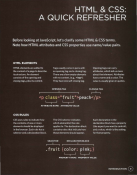
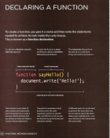
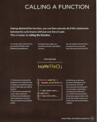
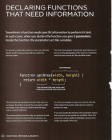
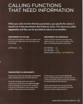
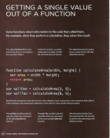
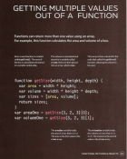

# Read: 06 - Programming with JavaScript

- ## Intro + Scripts

Javascript allows you to make web pages more interactive by accessing and modyfing the content and the markup used in web pages while it is being viewed in the browser .
Javascript ecnompasses many of the traditional rules of programming .
It can make the web page feel interactive by responding to what the user does .

** 1- ACCESS CONTENT :** You can use JavaScript to select any element, attribute, or text from an
HTML page. For example:
• Select the text inside all of the `<hl>` elements on a page .
• Select any elements that have a class attribute with a value of note .
• Find out what was entered into a text input whose id attribute has a
value of email .

** 2- MODIFY CONTENT :** You can use JavaScript to add elements, attributes, and text to the
page, or remove them. For example:
• Add a paragraph of text after the first `<hl>` element .
• Change the value of class attributes to trigger new CSS rules for those elements .
• Change the size or position of an `` element .

** 3- PROGRAM RULES :** You can specify a set of steps for the browser to follow (like a recipe), which allows it to access or change the content of a page. For example:
• A gallery script could check which image a user clicked on and display a larger version of that image.
• A mortgage calculator could collect values from a form, perform a
ca lculation, and display repayments.
• An animation could check the dimensions of the browser window and move an image to the bottom of the viewable area (also known as the viewport). 

** 4- REACT TO EVENTS :** You can specify that a script should run
when a specific event has occurred. For example, it could be run when:
• A button is pressed
• A link is clicked (or tapped) on
• A cursor hovers over an element
• Information is added to a form
• An interval of time has passed
• A web page has finished loading

;
;
;

- ## Expressions + Operators

An expression evaluates into (results in) a single value. Broadly speaking there are two types of expressions. 

 ***1- EXPRESSIONS THAT JUST ASSIGN A VALUE TO A VARIABLE :***
 In order for a variable to be useful, it needs to be given a value. As you have seen, this is done using the assignment operator (the equals sign).
**`var color = 'beige';`**
The value of co 1 or is now beige.

***2- EXPRESSIONS THAT USE TWO OR MORE VALUES TO RETURN A SINGLE VALUE :***
You can perform operations on any number of individual values (see next page) to determine a single value. For example:
**`var area = 3 * 2;`**
The value of area is now 6.
Here the expression 3 * 2 evaluates into 6. This example also uses the assignment operator, so the result of the expression 3 * 2 is stored in the variable called area. 

- ## Functions 

Functions let you group a series of statements together to perform a specific task. If different parts of a script repeat the same task, you can reuse the function (rather than repeating the same set of statements).

;
;
;
;
;
;
