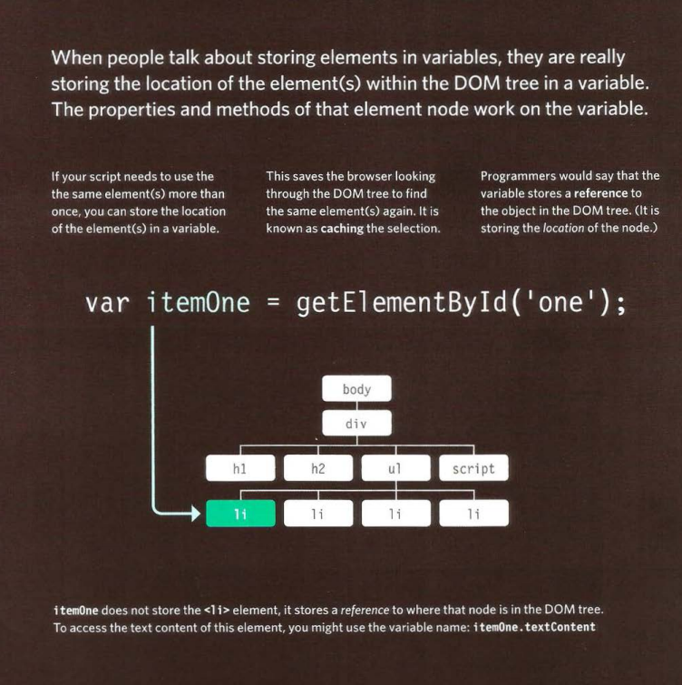

# Read: 06 - JS Object Literals; The DOM

## Chapter 3: “Object Literals”

### WHAT IS AN OBJECT? 
Objects group together a set of variables and functions to create a model of a something you would recognize from the real world. In an object, variables and functions take on new names. 

##### IN AN OBJECT: VARIABLES BECOME KNOWN AS PROPERTIES 
If a variable is part of an object, it is called a ***property***. Properties tell us about the object, such as the name of a hotel or the number of rooms it has. Each individual hotel might have a different name and a different number of rooms. 
##### IN AN OBJECT: FUNCTIONS BECOME KNOWN AS METHODS 
If a function is part of an object, it is called a ***method***. Methods represent tasks that are associated with the object. For example, you can check how many rooms are available by subtracting the number of booked rooms from the total number of rooms. 
**This object represents a hotel. It has five properties and one method. The object is in curly braces. It is stored in a variablecalled hotel .** 
Like variables and named functions, properties and methods have a name and a value. In an object, that name is called a **key**. 

## Chapter 5: “Document Object Model”

#### THE DOM TREE IS A MODEL OF A WEB PAGE

As a browser loads a web page, it creates a model of that page. The model is called a DOM tree, and it is stored in the browsers' memory. It consists of four main types of nodes. 

#### ACCESSING ELEMENTS 
**DOM queries may return one element, or they may return a Nodelist, which is a collection of nodes.**

Sometimes you will just want to access one individual element (or a fragment of the page that is stored within that one element).Other times you may want to select a group of element s, for example,every `<hl>` element in the page or every `<1 i>` element within a particular list. 

### Summary

+ The browser represents the page using a DOM tree. 
+ DOM trees have four types of nodes: document nodes, element nodes, attribute nodes, and text nodes. 
+ You can select element nodes by their id or cl ass attributes,by tag name, or using CSS selector syntax. 
+ Whenever a DOM query can return more than one node, it will always return a Nadel i st. 
+ From an element node, you can access and update its content using properties such as textContent and i nnerHTML or using DOM manipulation techniques. 
+ An element node can contain multiple text nodes and child elements that are siblings of each other. 
+ In older browsers, implementation of the DOM is inconsistent (and is a popular reason for using jQuery). 
+ Browsers offer tools for viewing the DOM tree . 

