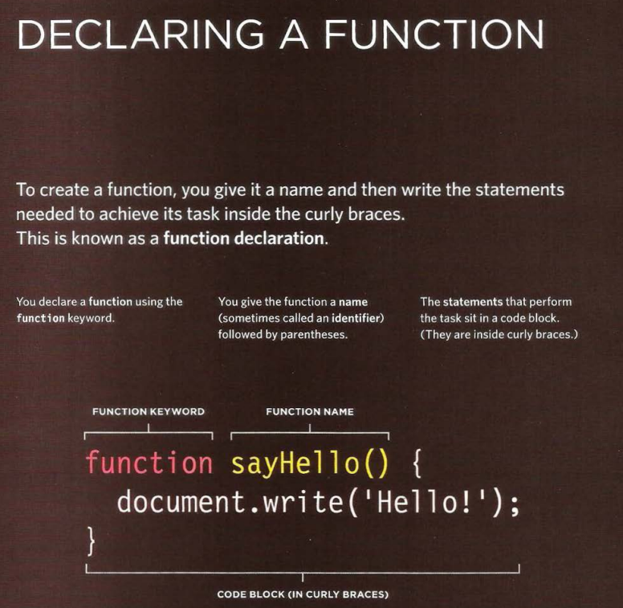
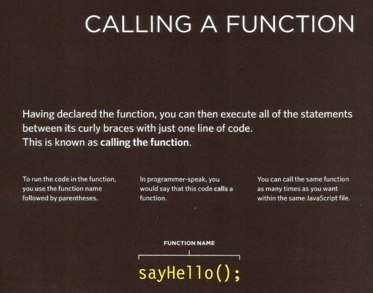
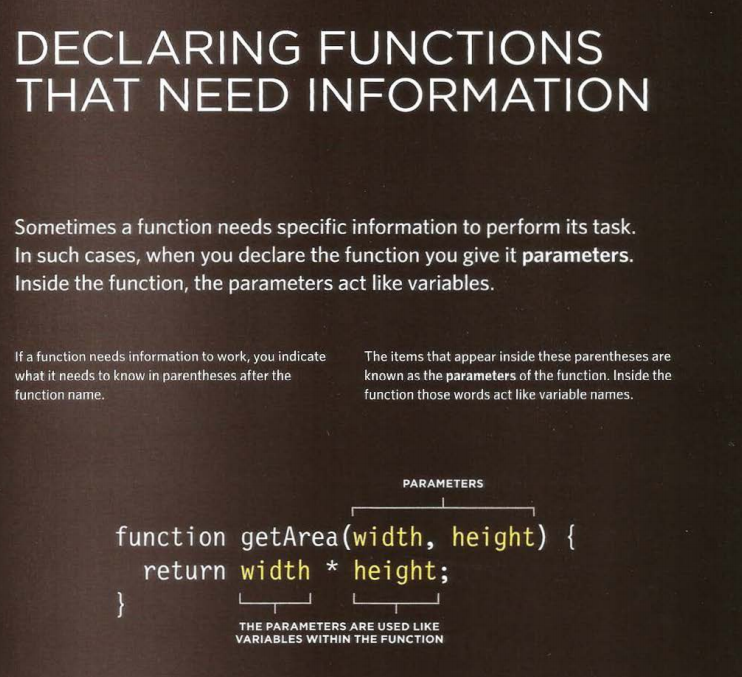
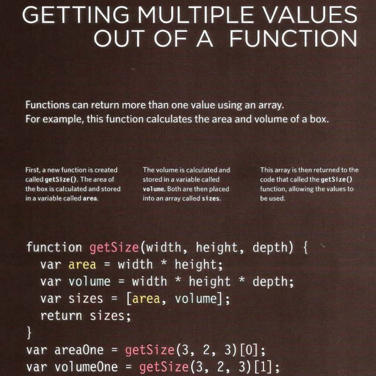

# Read: 07 - HTML Tables; JS Constructor Functions

## Chapter 6: “Tables” 

### What's a Table?

A table represents information in a grid format. Examples of tables include financial reports, TV schedules, and sports results.

### Basic Table Structure
> `<table>`

The `<table>` element is used to create a table. The contents of the table are written out row by row.

> `<tr>`

You indicate the start of each row using the opening `<tr>` tag. The tr stands for table row.) It is followed by one or more `<td>` elements (one for each cell in that row). At the end of the row you use a closing `</tr>` tag.

> `<td>`

Each cell of a table is represented using a `<td>` element. (The td stands for table data.) At the end of each cell you use a closing `</td>` tag.

### Table Headings
> `<th>`

The `<th>` element is used just like the `<td>` element but its purpose is to represent the heading for either a column or a row. (The th stands for table heading)  .

### Long Tables

> `<thead>`

The headings of the table should sit inside the <thead> element. 
> `<tbody>`

The body should sit inside the `<tbody>` element. 

> `<tfoot>`

The footer belongs inside the `<tfoot>` element.

## Summary

+ The `<table>` element is used to add tables to a web page.
+ A table is drawn out row by row. Each row is created with the `<tr>` element.
+ Inside each row there are a number of cells represented by the `<td>` element (or `<th>` if it is a header).
+ You can make cells of a table span more than one row or column using the rowspan and colspan attributes.
+ For long tables you can split the table into a `<thead>`, `<tbody>`, and `<tfoot>`

## Chapter 3: “Functions, Methods, and Objects” 

#### WHAT IS A FUNCTION?
Functions let you group a series of statements together to perform a specific task. If different parts of a script repeat the same task, you can reuse the function (rather than repeating the same set of statements). 

