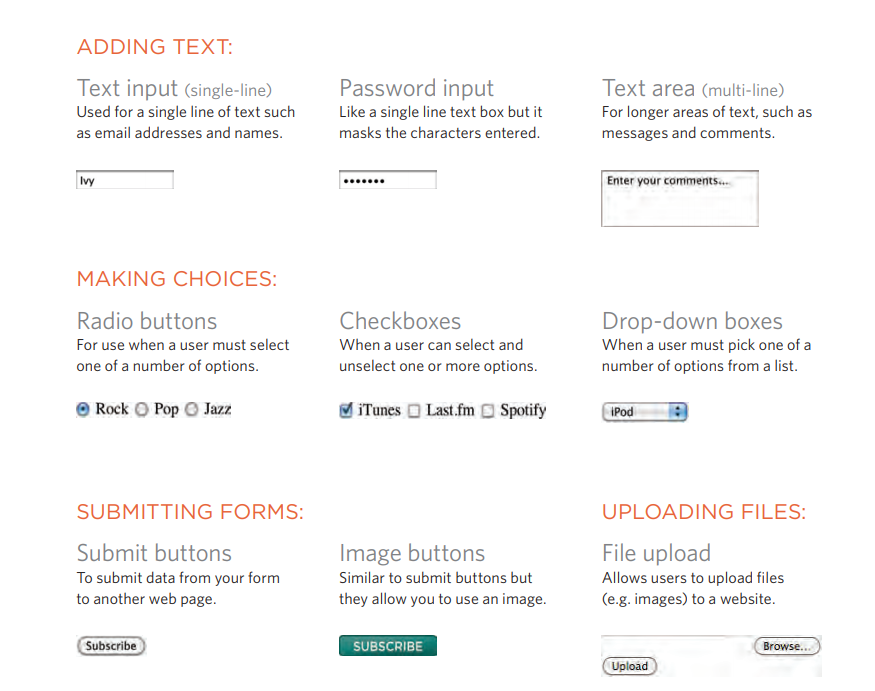
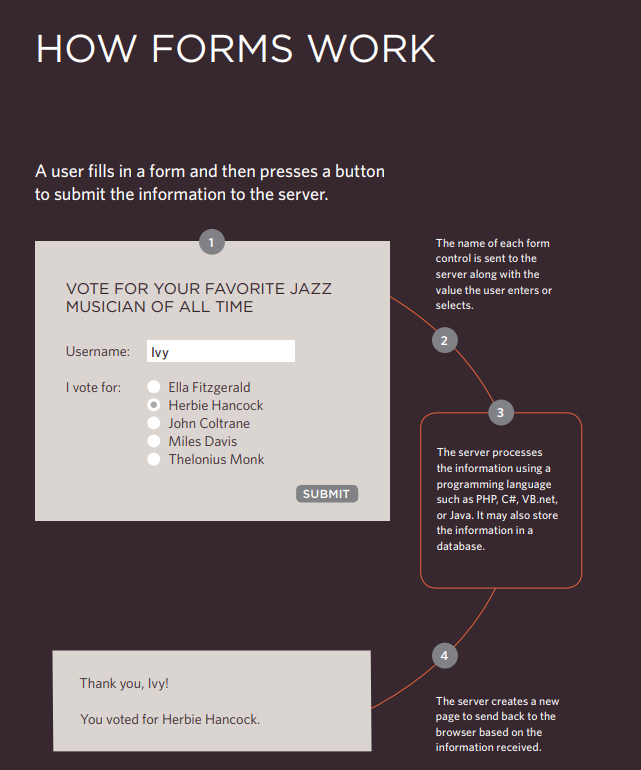

# Read: 09 - Forms and Events

## ***HTML***

## Chapter 7: “Forms”

#### Why Forms?
The best known form on the web is probably the search box that sits right in the middle of Google's homepage.

#### Form Controls

#### 1- Form Structure

`<form>`
Form controls live inside a `<form>` element. This element 
should always carry the actionattribute and will usually have a 
method and id attribute too.

> action

Every `<form>` element requires an action attribute. Its value
is the URL for the page on the server that will receive the 
information in the form when it is submitted.

> method

Forms can be sent using one of two methods: get or post.

#### 2- Text Input
`<input>`
The `<input>` element is used to create several different form controls. The value of the typeattribute determines what kind of input they will be creating.

>`type="text"`

When the type attribute has a 
value of text, it creates a singleline text input.

>`name`

When users enter information into a form, the server needs to know which form control each piece of data was entered into. (For example, in a login form, the server needs to know what has been entered as the username and what has been given as the password.) Therefore, each form control requires a name attribute. The value of this attribute identifies the form control and is sent along with the information they enter to the server.

>`maxlength`

You can use the maxlengthattribute to limit the number of characters a user may enter into the text field. Its value is the number of characters they may enter. For example, if you were asking for a year, the maxlengthattribute could have a value of 4.

#### 3- Password Input
> <input> `type="password"`

When the type attribute has a value of password it creates a text box that acts just like a single-line text input, except the characters are blocked out. They are hidden in this way so that if someone is looking over the user's shoulder, they cannot see sensitive data such as passwords.

>`name`

The name attribute indicates the name of the password input, which is sent to the server with the password the user enters.

> `size, maxlength`

It can also carry the size and maxlength attributes like the the single-line text input.

#### 4- Text Area

The `<textarea>` element is used to create a mutli-line text input. Unlike other input elements this is not an empty element. It should therefore have an opening and a closing tag. Any text that appears between the opening `<textarea>`
<textarea> Text Area </textarea>
and closing  tags `</textarea>`will appear in the text box when the page loads.
If the user does not delete any text between these tags, this message will get sent to the server along with whatever the user has typed. (Some sites use JavaScript to clear this information when the user clicks in the text area.)

#### 5- Radio Button
> `type="radio"`

Radio buttons allow users to pick just one of a number of options.

> `name`

The name attribute is sent to the server with the value of the option the user selects. When a question provides users with options for answers in the form of radio buttons, the value of the name attribute should be the same for all of the radio buttons used to answer that question.

> `value`

The value attribute indicates the value that is sent to the server for the selected option. The value of each of the buttons in a group should be different (so that the server knows which option the user has selected).

> `checked`

The checked attribute can be used to indicate which value (if any) should be selected when the page loads. The value of this attribute is checked. Only one radio button in a group should use this attribute.

### Summary

* Whenever you want to collect information from visitors you will need a form, which lives inside a `<form>` element.
* Information from a form is sent in name/value pairs.
* Each form control is given a name, and the text the user typesin or the values of the options they select are sent to the server.
* HTML5 introduces new form elements which make it easier for visitors to fill in forms

## Chapter 14: “Lists, Tables & Forms”

#### 1- Bullet Point Styles
> `list-style-type`

The list-style-type property allows you to control the shape or style of a bullet point (also known as a marker). It can be used on rules that apply to the `<ol>`, `<ul>`, and `<li>`elements.

> Unordered Lists

For an unordered list you can use the following values:
 `none`
 `disc`
 `circle`
 `square`

> Ordered Lists

For an ordered (numbered) list you can use the following values:
`decimal`
1 2 3
`decimal-leading-zero`
01 02 03
`lower-alpha`
a b c
`upper-alpha`
A B C
`lower-roman`
i. ii. iii.
`upper-roman` 
I II III

#### 2- Images for Bullets
`list-style-image`
You can specify an image to act as a bullet point using the list-style-image property.The value starts with the letters url and is followed by a pair of parentheses. Inside the parentheses,the path to the image is given inside double quotes.This property can be used on rules that apply to the `<ul>` and `<li>` elements.The example on this page also shows the use of the margin property to increase the vertical gap between each item in the list.

### Summary 
* In addition to the CSS properties covered in other chapters which work with the contents of all elements, there are several others that are specifically used to control the appearance of lists, tables, and forms.

* List markers can be given different appearances using the list-style-type and list-style image properties.

* Table cells can have different borders and spacing in different browsers, but there are properties you can use to control them and make them more consistent. 

* Forms are easier to use if the form controls are vertically aligned using CSS.

* Forms benefit from styles that make them feel more interactive.

